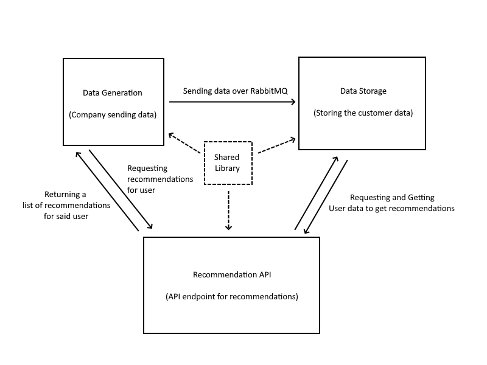
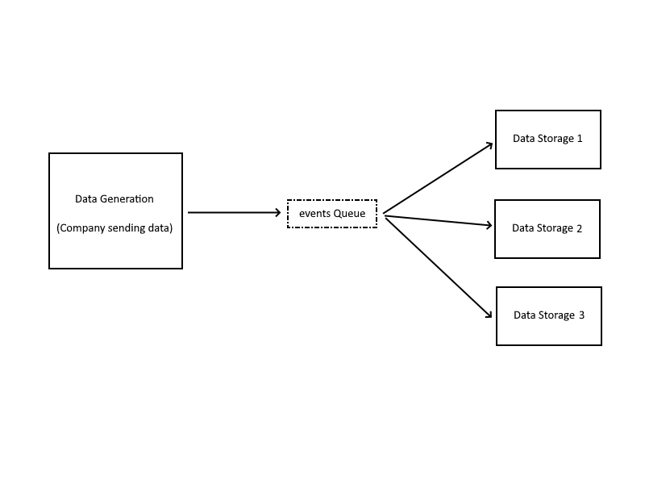

# Systems Programming Recommendation Engine

### Description

A recommendation system based on a sports betting website. Developed for Uni course "Systems Programming"

## Requirements

You need to have Node.js and npm installed.
You also need to have TypeScript installed globally.
You will finally need docker compose install

## Build and Run

`./prerun.sh && docker compose up --build`

## Shared Library Contents

The shared library contains mostly interfaces and types and some utility functions. 

## Project Architecture

The project is divided into 2 big parts:
- The shared library
- The other projects

This is done to decouple the code and make it easier to maintain and test. Also the reason why the shared library is a separate project is to make it easier to share it with other projects, by that I mean that the shared library is the only dependency of the other projects and there is no dependency mess.

## `Data Generation` Project Architecture

The data generation project has 4 main components:
- The data generation interface/implementations
- The data generation service
- The messaging producer
- And the dummy data to generate events from

The data generation service is the main component of the project, it is responsible for generating the events and sending them to the messaging producer. The data generation service uses the data generation interface to generate the events. The data generation interface is implemented by the data generation implementations. The data generation implementations are responsible for generating the events from the dummy data of the project. The messaging producer is responsible for sending the generated events to the queue.

We will talk about the messaging architecture on the `data storage` project

## `Data Storage` Project Architecture

The data storage project has 2 main components:

- The messaging consumer
- The data storage service

The messaging consumer is responsible for consuming the events from the queue and sending them to the data storage service. The data storage service is responsible for storing the events in the database.

### Messaging Architecture

The messaging architecture is based on the [worker queue](https://www.rabbitmq.com/tutorials/tutorial-two-javascript) pattern. The messaging producer sends the events to a single queue and the messaging consumer consumes the events from the queue. The messaging producer and the messaging consumer are decoupled, this means that the messaging producer and the messaging consumer can be scaled independently. The messaging producer and the messaging consumer are also fault-tolerant, this means that if the messaging producer or the messaging consumer fails, the other one can still work. 

The queue:
- is **durable**: this means that if the messaging broker fails, the queue will still be there when the messaging broker comes back up.
- has **acknowledgment**: this means that the messaging consumer has to acknowledge the message after it has been processed. If the messaging consumer fails to acknowledge the message, the message will be sent to another messaging consumer.
- has **fair dispatch**: this means that the messages are sent to the messaging consumers in a round-robin way.
- has **prefetch** set to 1: this means that the messaging consumer will only receive one message at a time. So this removes the negative effect of the fair dispatch, which is uneven distribution of "heavy" messages to consumers.

### Demo of message flow

https://github.com/NikosGour/systems-programming-project/assets/63046380/3b5cb4d3-5bb0-4df9-bebb-eb6f313ee37e

### Adding more consumer to scale out

With this architecture, we can easily scale out the messaging consumer. We can add more messaging consumers to the queue and the messages will be distributed in a round-robin way to the messaging consumers. This will increase the throughput of the system.

https://github.com/NikosGour/systems-programming-project/assets/63046380/17f7e138-e57e-44f7-98c6-963a4244141d

To add more producers, with this architecture, is easy. We can just add a new queue that the new producer can bind to and start sending messages to the queue. We also need to add a new messaging consumer to consume the messages from the new queue.

#### Side note: quick tutorial to use [rabbitmq visualizer](https://jmcle.github.io/rabbitmq-visualizer/#)

https://github.com/NikosGour/systems-programming-project/assets/63046380/b540a669-14af-4e08-a612-fe5428b0505a

## `Recommender` Project Architecture
The recommender project has 3 main components:

- The recommendation API
- The recommender interface/implementations
- The data storage query service

The recommendation API is the main component of the project, it is responsible for receiving the requests and sending the responses. The recommendation API uses the recommender interface to generate the recommendations. The recommender interface is implemented by the recommender implementations. The recommender implementations are responsible for generating the recommendations from the data storage query service. The data storage query service is responsible for querying the database for the events and sending them to the recommender implementations to generate the recommendations.